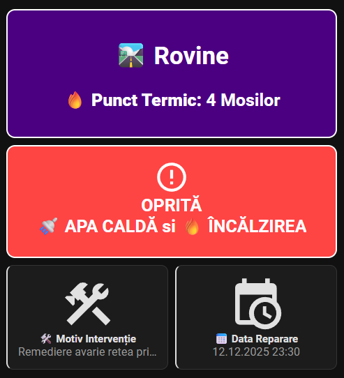
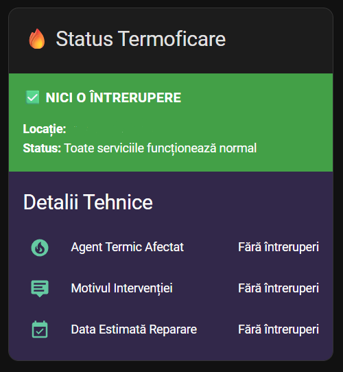
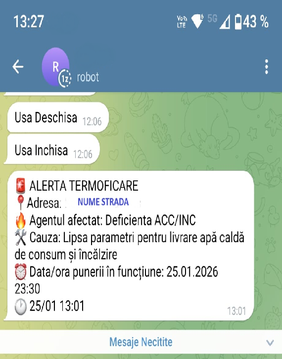

# 🔥 **CMTEB Termoficare - 🏠 Integrare pentru Home Assistant**

[](https://github.com/hacs/integration)
[](https://www.home-assistant.io/)


## Integrare pentru monitorizarea in timp real a intreruperilor in furnizarea agentului termic a Companiei Municipale TERMOENERGETICA Bucuresti.

---

## 🚀 Caracteristici

### ✨ Functionalitati Principale
- ✅ **Monitorizare in timp real** a intreruperilor la termoficare
- ✅ **Sistem inteligent de cautare** cu recunoastere prescurtari
- ✅ **Configurare grafica** - fara editare manuală YAML
- ✅ **Senzori cu nume semnificative** bazate pe adresă
- ✅ **Actualizare automata** la fiecare 30 de minute
- ✅ **Actualizare manuala** cand se doreste
- ✅ **Support pentru multiple adrese** simultan
- ✅ **Carduri Lovelace personalizate** incluse

### 🔍 Sistem Inteligent de Căutare
Integrarea recunoaște automat toate (aproape toate) variantele de scriere pentru strazi:

| Tu introduci: | Site-ul CMTEB afiseaza: | Rezultat: |
|---------------|-------------------------|-----------|
| `str Litovoi Voievod` | ` Str Litovoi Voievod` | ✅ **Potrivire** |
| `Apusului` | `Str Apusului` | ✅ **Potrivire** |
| `Sos Pantelimon` | `Şoseaua Pantelimon` | ✅ **Potrivire** |
| `drm Taberei` | `Drumul Taberei` | ✅ **Potrivire** |
| `p-ta Romană` | `Piața Romană` | ✅ **Potrivire** |

---

## 📦 Instalare

### Metoda 1: Prin HACS (Recomandat)  <br>[](https://my.home-assistant.io/redirect/hacs_repository/?owner=GeorgeRPI&repository=cmteb_termoficare&category=Integration)<br>
1. Deschide **HACS** în Home Assistant  
2. Click pe **Integrations**  
3. Click pe butonul cu 3 puncte (⋮) din coltul dreapta sus  
4. Selecteaza **Custom repositories**  
5. Adauga URL-ul: `https://github.com/GeorgeRPI/cmteb_termoficare`  
6. Selectează categoria **Integration**  
7. Click **Add**  
8. Cauta **"CMTEB Termoficare"** în lista de integrari noi  
9. Click **Download**  
10. **Reporneste Home Assistant**  

### Metoda 2: Instalare Manuala
1. Descarca ultima versiune de pe [GitHub Releases](https://github.com/GeorgeRPI/cmteb_termoficare/releases)
2. Copiaza directorul `cmteb_termoficare` in `config/custom_components/`
3. Reporneste Home Assistant
4. Adauga integrarea din **Settings → Devices & Services → Add Integration**

---

## ⚙️ Configurare

### Pasul 1: Adauga Integrarea
1. Mergi la **Settings** → **Devices & Services** → **Integrations**
2. Click pe **Add Integration**
3. Cauta **"CMTEB Termoficare"**
4. Click pe integrare pentru a o configura

### Pasul 2: Completează Datele
- **📝 Adresa:** Introdu adresa în orice variantă
- **🏭 Punct Termic:** Numele punctului termic specific (se gaseste pe harta)

### 📋 Exemple Adrese Valide si Punct termic
- `"Str Zambilelor" - Punct termic: "Opanez"`
- `"bd. Unirii 15" - Punct termic: "Tribunal"`
- `"Sos Pantelimon" - Punct termic: "19 Pantelimon"`
- `"Drm Timonierului" - Punct termic: "13 Liniei"`
- `"Bld Mareşal Alexandru Averescu" - Punct termic: "Miciurin"`
- `"se poate introduce doar numele strazi dar nu va fi precis"`

---

## 🔧 Senzori Generati

### Structura Senzori
Fiecare adresa adaugata creeaza 3 senzori unici:

| Senzor | Descriere | Exemplu Valori |
|--------|-----------|----------------|
| `sensor.cmteb_agent_afectat_[nume_adresa_punct_termic]` | Agentul termic afectat | `"INCALZIRE"`, `"APA CALDA"` |
| `sensor.cmteb_cauza_interventie_[nume_adresa_punct_termic]` | Descrirea interventiei | `"Defectiune retea"` |
| `sensor.cmteb_data_estimata_reparatie_[nume_adresa_punct_termic]` | Data si ora estimata reparatiei | `"25.11.2025 18:00"` |

### 🏷️ Exemple Nume Senzori
| Adresa Introdusa | Punct termic |Entity ID Generat |
|------------------|-------------------|-------------------|
| `Str Grigore C. Moisil` | `Moisil 1` | `sensor.cmteb_agent_afectat_str_grigore_c_moisil_moisil_1` |
| `Bd. Unirii 15` | `Unirii tronson 2` | `sensor.cmteb_agent_afectat_bd_unirii_15_unirii_tronson_2` |


---

## 🎨 Carduri Lovelace
### 📱 Card:  Stare Detaliata 3 si cu Actualizare manuala
    Schimba culoare in functie de defectiune:
      - 🟢 VERDE + Text ALB = SISTEM FUNCȚIONAL
      - 🟡 GALBEN + Text NEGRU = Deficienta: Apa calda, Incalzire, Apa calda si Incalzire
      - 🔴 ROȘU + Text NEGRU = Oprire: Apa calda, Incalzire, Apa calda si Incalzire



```yaml
type: vertical-stack
cards:
  - type: custom:button-card
    name: "🔥Status: CMTEB București"
    tap_action:
      action: none
    hold_action:
      action: none
    styles:
      card:
        - background: linear-gradient(135deg, 1a1a2e 0%, 16213e 100%)
        - color: white
        - font-weight: bold
        - border-radius: 13px
        - padding: 10px
        - text-align: center
        - box-shadow: var(--box-shadow)
        - border: 2px solid gold
        - margin-bottom: 1px
      icon:
        - color: gold
        - width: 35px
        - height: 35px
        - margin-right: 10px
      name:
        - font-size: 22px
        - text-transform: uppercase
        - letter-spacing: 0.8px
  - type: markdown
    content: >
      # 🛣️ Str. {{
      state_attr('sensor.cmteb_agent_afectat_STRADA_PUNCT_TERMIC',
      'Adresa') }}


      ## 🔥 Punct Termic: {{
      state_attr('sensor.cmteb_agent_afectat_STRADA_PUNCT_TERMIC',
      'Punct_Termic') | default('General') }}
    card_mod:
      style: |
        ha-card {
          background: #4b0082;
          color: white;
          text-align: center;
          font-weight: bold;
          padding: 15px;
          border-radius: 13px;
          box-shadow: var(--box-shadow);
          border: 2px solid white;
          margin-bottom: 10px;
        }
        h2 {
          font-size: 1.5em;
          margin-bottom: 10px;
        }
  - type: custom:button-card
    entity: sensor.cmteb_agent_afectat_STRADA_PUNCT_TERMIC
    name: |
      [[[
        if (entity.state === 'INCALZIRE' || entity.state === 'Oprire INC') return '🔥 INCALZIRE (INC)';
        if (entity.state === 'APA CALDA' || entity.state === 'Oprire ACC') return '🚿 APA CALDA (ACC)';
        if (entity.state === 'Oprire ACC/INC') return 'OPRITA<br>🚿 APA CALDA si 🔥 INCALZIREA'; 
        if (entity.state === 'Deficienta INC') return '⚠️ DEFICIENTA 🔥 INCALZIRE';
        if (entity.state === 'Deficienta ACC') return '⚠️ DEFICIENTA 🚿 APA CALDA';
        if (entity.state === 'Deficienta ACC/INC') return '⚠️ DEFICIENTA<br>🚿 APA CALDA si 🔥 INCALZIRE';
        return '🌡️ SISTEM FUNCȚIONAL';
      ]]]
    icon: |
      [[[
        if (entity.state === 'INCALZIRE' || entity.state === 'APA CALDA' || entity.state.includes('Deficienta') || entity.state.includes('Oprire')) return 'mdi:alert-circle-outline';
        return 'mdi:check-circle-outline';
      ]]]
    state_display: |
      [[[
        if (entity.state === 'INCALZIRE' || entity.state === 'Oprire INC') return '🚨 OPRITA';
        if (entity.state === 'APA CALDA' || entity.state === 'Oprire ACC') return '🚨 OPRITA';
        if (entity.state === 'Oprire ACC/INC') return '🚨 OPRITA';
        if (entity.state === 'Deficienta INC') return '⚠️ DEFICIENTA';
        if (entity.state === 'Deficienta ACC') return '⚠️ DEFICIENTA';
        if (entity.state === 'Deficienta ACC/INC') return '⚠️ DEFICIENTA';
        return '🟢 ACTIV';
      ]]]
    styles:
      card:
        - background-color: |
            [[[
              // GALBEN pentru toate stările cu "Deficienta"
              if (entity.state.includes('Deficienta')) return '#FFCC00';
              
              // ROSU pentru toate stările cu "Oprire" și pentru INCALZIRE/APA CALDA
              if (entity.state === 'INCALZIRE' || entity.state === 'APA CALDA' || 
                  entity.state.includes('Oprire')) return '#ff4444';
              
              // VERDE doar pentru SISTEM FUNCTIONAL
              return '#4CAF50';
            ]]]
        - color: |
            [[[
              // SCRIS NEGRU doar pentru stările GALBENE (Deficiență)
              if (entity.state.includes('Deficienta')) return '#000000';
              
              // SCRIS ALB pentru toate celelalte stări
              return '#FFFFFF';
            ]]]
        - font-weight: bold
        - border-radius: 13px
        - padding: 15px
        - text-align: center
        - box-shadow: var(--box-shadow)
        - border: 2px solid white
        - height: 100px
        - display: flex
        - flex-direction: column
        - justify-content: center
        - align-items: center
        - margin-bottom: 1px
      icon:
        - color: |
            [[[
              // ICONITA NEGRĂ doar pentru stările GALBENE (Deficiență)
              if (entity.state.includes('Deficienta')) return '#000000';
              
              // ICONITA ALBĂ pentru toate celelalte stări
              return '#FFFFFF';
            ]]]
        - width: 40px
        - height: 40px
      name:
        - font-size: 20px
        - margin-bottom: 8px
        - line-height: 1.2
      state:
        - font-size: 15px
        - font-weight: normal
  - type: custom:button-card
    entity: sensor.cmteb_cauza_interventie_STRADA_PUNCT_TERMIC
    name: 🛠️ Cauza / Descrierea interventiei
    icon: mdi:hammer-wrench
    show_state: true
    styles:
      card:
        - background-color: |
            [[[
              const mainState = states['sensor.cmteb_agent_afectat_STRADA_PUNCT_TERMIC'].state;
              
              // GALBEN pentru deficiențe
              if (mainState.includes('Deficienta')) return '#FFCC00';
              
              // ROSU pentru oprire și alte stări problematice
              if (mainState === 'INCALZIRE' || mainState === 'APA CALDA' || 
                  mainState.includes('Oprire')) {
                return '#ff4444';
              }
              
              // NEGRU pentru sistem funcțional
              return '#000000';
            ]]]
        - color: |
            [[[
              const mainState = states['sensor.cmteb_agent_afectat_STRADA_PUNCT_TERMIC'].state;
              
              // SCRIS NEGRU doar pentru stările GALBENE (Deficiență)
              if (mainState.includes('Deficienta')) return '#000000';
              
              // SCRIS ALB pentru toate celelalte stări
              return '#FFFFFF';
            ]]]
        - border-radius: 13px
        - padding: 15px
        - text-align: center
        - box-shadow: var(--box-shadow)
        - border: 2px solid white
        - height: 100px
        - display: flex
        - flex-direction: column
        - justify-content: center
        - align-items: center
        - margin-bottom: 1px
      icon:
        - color: |
            [[[
              const mainState = states['sensor.cmteb_agent_afectat_STRADA_PUNCT_TERMIC'].state;
              
              // ICONITA NEGRĂ doar pentru stările GALBENE (Deficiență)
              if (mainState.includes('Deficienta')) return '#000000';
              
              // ICONITA ALBĂ pentru toate celelalte stări
              return '#FFFFFF';
            ]]]
        - width: 40px
        - height: 40px
        - margin-bottom: 8px
      name:
        - font-size: 14px
        - font-weight: bold
        - margin-bottom: 5px
      state:
        - font-size: 16px
        - font-weight: bold
  - type: custom:button-card
    entity: sensor.cmteb_data_estimata_reparatie_STRADA_PUNCT_TERMIC
    name: 📅 Data/ora estimarii punerii în functiune
    icon: mdi:calendar-clock
    show_state: true
    styles:
      card:
        - background-color: |
            [[[
              const mainState = states['sensor.cmteb_agent_afectat_STRADA_PUNCT_TERMIC'].state;
              
              // GALBEN pentru deficiențe
              if (mainState.includes('Deficienta')) return '#FFCC00';
              
              // ROSU pentru oprire și alte stări problematice
              if (mainState === 'INCALZIRE' || mainState === 'APA CALDA' || 
                  mainState.includes('Oprire')) {
                return '#ff4444';
              }
              
              // NEGRU pentru sistem funcțional
              return '#000000';
            ]]]
        - color: |
            [[[
              const mainState = states['sensor.cmteb_agent_afectat_STRADA_PUNCT_TERMIC'].state;
              
              // SCRIS NEGRU doar pentru stările GALBENE (Deficiență)
              if (mainState.includes('Deficienta')) return '#000000';
              
              // SCRIS ALB pentru toate celelalte stări
              return '#FFFFFF';
            ]]]
        - border-radius: 13px
        - padding: 15px
        - text-align: center
        - box-shadow: var(--box-shadow)
        - border: 2px solid white
        - height: 100px
        - display: flex
        - flex-direction: column
        - justify-content: center
        - align-items: center
      icon:
        - color: |
            [[[
              const mainState = states['sensor.cmteb_agent_afectat_STRADA_PUNCT_TERMIC'].state;
              
              // ICONITA NEGRĂ doar pentru stările GALBENE (Deficiență)
              if (mainState.includes('Deficienta')) return '#000000';
              
              // ICONITA ALBĂ pentru toate celelalte stări
              return '#FFFFFF';
            ]]]
        - width: 40px
        - height: 40px
        - margin-bottom: 8px
      name:
        - font-size: 14px
        - font-weight: bold
        - margin-bottom: 5px
      state:
        - font-size: 16px
        - font-weight: bold
  - type: custom:button-card
    entity: sensor.cmteb_agent_afectat_STRADA_PUNCT_TERMIC
    name: Actualizeaza manual
    icon: mdi:refresh
    layout: icon_name
    show_state: false
    tap_action:
      action: call-service
      service: homeassistant.update_entity
      target:
        entity_id:
          - sensor.cmteb_agent_afectat_STRADA_PUNCT_TERMIC
          - sensor.cmteb_cauza_interventie_STRADA_PUNCT_TERMIC
          - sensor.cmteb_data_estimata_reparatie_STRADA_PUNCT_TERMIC
    show_label: true
    label: |
      [[[
        // Funcție pentru formatarea timpului
        function formatTimeAgo(date) {
          const now = new Date();
          const diff = Math.floor((now - date) / 1000);
          
          if (diff < 2) return 'chiar acum';
          if (diff < 60) return `${diff} secunde`;
          if (diff < 120) return '1 minut';
          if (diff < 3600) return `${Math.floor(diff / 60)} minute`;
          if (diff < 7200) return '1 oră';
          if (diff < 86400) return `${Math.floor(diff / 3600)} ore`;
          if (diff < 172800) return '1 zi';
          return `${Math.floor(diff / 86400)} zile`;
        }
        
        // Returnează textul
        const lastUpdated = new Date(entity.last_updated);
        return `Actualizat acum ${formatTimeAgo(lastUpdated)}`;
      ]]]
    styles:
      card:
        - border-radius: 7px
        - border: 1px solid var(--divider-color)
        - padding: 4px 8px !important
        - height: 45px
        - background: >-
            radial-gradient(circle at center, rgba(var(--rgb-primary-color),
            0.08) 0%, transparent 70%)
        - transition: all 0.3s ease
        - border: 2px solid red
      card:hover:
        - background: >-
            radial-gradient(circle at center, rgba(var(--rgb-primary-color),
            0.2) 0%, rgba(var(--rgb-primary-color), 0.08) 70%)
        - border-color: var(--primary-color)
      name:
        - font-size: 13px
        - text-transform: uppercase
        - letter-spacing: 0.7px
        - margin-bottom: 2px
      icon:
        - color: var(--primary-color)
      label:
        - font-size: 10px
        - color: var(--secondary-text-color)
        - font-style: italic
        - text-align: center
        - margin-top: "-2px"
    state_color: false
    show_header_toggle: false


```
### 📱 Card:  Stare Detaliata 2


```yaml
type: vertical-stack
cards:
  - type: markdown
    content: >
      # 🛣️ {{
      state_attr('sensor.cmteb_agent_afectat_STRADA_PUNCT_TERMIC',
      'Adresa') }}
      ## **🔥 Punct Termic:** {{
      state_attr('sensor.cmteb_agent_afectat_STRADA_PUNCT_TERMIC',
      'Punct_Termic') | default('General') }}
    card_mod:
      style: |
        ha-card {
          background: #4b0082 ;
          color: white;
          text-align: center;
          font-weight: bold;
          padding: 15px;
          border-radius: 10px;
          box-shadow: var(--box-shadow);
          border: 2px solid white
        }
        h2 {
          font-size: 1.5em;
          margin-bottom: 10px;
        }
  - type: custom:button-card
    entity: sensor.cmteb_agent_afectat_STRADA_PUNCT_TERMIC
    name: |
      [[[
        if (entity.state === 'INCALZIRE' || entity.state === 'Oprire INC') return '🔥 INCALZIRE (INC)';
        if (entity.state === 'APA CALDA' || entity.state === 'Oprire ACC') return '🚿 APA CALDA (ACC)';
        if (entity.state === 'Oprire ACC/INC') return 'OPRITA<br> 🚿 APA CALDA si 🔥 INCALZIREA'; 
        if (entity.state === 'Deficienta INC') return '⚠️ DEFICIENTĂ 🔥 INCALZIRE';
        if (entity.state === 'Deficienta ACC') return '⚠️ DEFICIENTĂ 🚿 APA CALDA';
        if (entity.state === 'Deficienta ACC/INC') return '⚠️ DEFICIENTA<br> 🚿 APA CALDA si 🔥 INCALZIRE';
        return '✅ SISTEM FUNCȚIONAL';
      ]]]
    icon: |
      [[[
        if (entity.state === 'INCALZIRE' || entity.state === 'APA CALDA' || entity.state.includes('Deficienta') || entity.state.includes('Oprire')) return 'mdi:alert-circle-outline';
        return 'mdi:check-circle-outline';
      ]]]
    state_display: |
      [[[
        if (entity.state === 'INCALZIRE' || entity.state === 'Oprire INC') return '🚨 OPRITA';
        if (entity.state === 'APA CALDA' || entity.state === 'Oprire ACC') return '🚨 OPRITA';
        if (entity.state === 'Oprire ACC/INC') return '🚨 OPRITA';
        if (entity.state === 'Deficienta INC') return '🚫 DEFICIENTA';
        if (entity.state === 'Deficienta ACC') return '🚫 DEFICIENTA';
        if (entity.state === 'Deficienta ACC/INC') return '🚫 DEFICIENTA';
        return '🟢 ACTIV';
      ]]]
    styles:
      card:
        - background-color: |
            [[[
              if (entity.state === 'INCALZIRE' || entity.state === 'APA CALDA' || 
                  entity.state.includes('Deficienta') || entity.state.includes('Oprire')) return '#ff4444';
              return '#4CAF50';
            ]]]
        - color: white
        - font-weight: bold
        - border-radius: 10px
        - padding: 15px
        - text-align: center
        - box-shadow: var(--box-shadow)
        - border: 2px solid white
      icon:
        - color: white
        - width: 40px
        - height: 40px
      name:
        - font-size: 20px
        - margin-bottom: 8px
        - line-height: 1.2
      state:
        - font-size: 15px
        - font-weight: normal
  - square: false
    type: grid
    columns: 2
    cards:
      - type: custom:button-card
        entity: sensor.cmteb_cauza_interventie_STRADA_PUNCT_TERMIC
        name: 🛠️ Motiv Interventie
        icon: mdi:hammer-wrench
        show_state: true
        styles:
          card:
            - background-color: var(--card-background-color)
            - border-radius: 8px
            - padding: 12px
            - border-left: 2px solid
            - box-shadow: var(--box-shadow)
          name:
            - font-size: 12px
            - font-weight: bold
            - color: var(--primary-text-color)
          state:
            - font-size: 13px
            - font-weight: normal
            - color: var(--secondary-text-color)
      - type: custom:button-card
        entity: sensor.cmteb_data_estimata_reparatie_STRADA_PUNCT_TERMIC
        name: 📅 Data Reparare
        icon: mdi:calendar-clock
        show_state: true
        styles:
          card:
            - background-color: var(--card-background-color)
            - border-radius: 8px
            - padding: 12px
            - border-left: 2px solid
            - box-shadow: var(--box-shadow)
          name:
            - font-size: 12px
            - font-weight: bold
            - color: var(--primary-text-color)
          state:
            - font-size: 13px
            - font-weight: normal
            - color: var(--secondary-text-color)

```

### 📱 Card:  Stare Detaliata 1


```yaml
type: custom:vertical-stack-in-card
title: 🔥 Status Termoficare
cards:
  - type: conditional
    conditions:
      - condition: state
        entity: sensor.cmteb_agent_afectat_STRADA_PUNCT_TERMIC
        state_not: Făra Intreruperi
    card:
      type: markdown
      content: >
        ### ⚠️ INTRERUPERE ACTIVA

        **Locatie:** {{
        states.sensor.cmteb_agent_afectat_STRADA_PUNCT_TERMIC.attributes.Adresa
        }}

        **Agent afectat:** {{
        states.sensor.cmteb_agent_afectat_STRADA_PUNCT_TERMIC.state }}

        **Cauza:** {{
        states.sensor.cmteb_cauza_interventie_STRADA_PUNCT_TERMIC.state
        }}

        **Data estimata reparare:** {{
        states.sensor.cmteb_data_estimata_reparatie_STRADA_PUNCT_TERMIC.state
        }}
      card_mod:
        style: |
          ha-card {
            background: var(--warning-color);
            color: var(--primary-text-color);
            border-left: 4px solid var(--error-color);
          }
  - type: conditional
    conditions:
      - condition: state
        entity: sensor.cmteb_agent_afectat_STRADA_PUNCT_TERMIC
        state: Fara intreruperi
    card:
      type: markdown
      content: >
        ### ✅ NICI O INTRERUPERE

        **Locatie:** {{
        states.sensor.cmteb_agent_afectat_STRADA_PUNCT_TERMIC.attributes.Adresa
        }}

        **Status:** Toate serviciile functionează normal
      card_mod:
        style: |
          ha-card {
            background: var(--success-color);
            color: white;
          }
  - type: entities
    entities:
      - entity: sensor.cmteb_agent_afectat_STRADA_PUNCT_TERMIC
        name: Agent Termic Afectat
        icon: mdi:fire-circle
      - entity: sensor.cmteb_cauza_interventie_STRADA_PUNCT_TERMIC
        name: Motivul Interventiei
        icon: mdi:tooltip-text
      - entity: sensor.cmteb_data_estimata_reparatie_STRADA_PUNCT_TERMIC
        name: Data Estimata Reparare
        icon: mdi:calendar-check
    title: Detalii Tehnice
    show_header_toggle: false
    state_color: false
    theme: synthwave

````
---
## 🔔 Automatizari

### 📢 Alerta Notificare Intrerupere


```yaml
alias: "🚨 CMTEB Termoficare "
description: Alerta CMTEB
triggers:
  - entity_id: sensor.cmteb_agent_afectat_STRADA_PUNCT_TERMIC
    to:
      - APA CALDA
      - INCALZIRE
      - Oprire INC
      - Oprire ACC
      - Oprire ACC/INC
      - Deficienta ACC/INC
      - Deficienta ACC
      - Deficienta INC
      - Functionare normala
      - Fara intreruperi
      - Fără întreruperi
    trigger: state
actions:
  - action: telegram_bot.send_message  ## Sau alta aplicatie pentru notificari
    data:
      message: >
        🚨 ALERTA TERMOFICARE

        📍Adresa: {{
        state_attr('sensor.cmteb_agent_afectat_STRADA_PUNCT_TERMIC',
        'Adresa') }}

        🔥 Agentul afectat: {{
        states('sensor.cmteb_agent_afectat_STRADA_PUNCT_TERMIC') }}

        🛠️ Cauza: {{
        states('sensor.cmteb_cauza_interventie_STRADA_PUNCT_TERMIC') }}

        ⏰ Data/ora punerii în funcțiune: {{
        states('sensor.cmteb_data_estimata_reparatie_STRADA_PUNCT_TERMIC')
        }}

        🕐 {{ now().strftime('%d/%m %H:%M')  }}


```
---
## 🛠️ Depanare
🔍 Logging pentru Debug
Adauga in configuration.yaml:
```yaml
logger:
  default: info
  logs:
    custom_components.cmteb_termoficare: debug
```
---
## ❌ Erori Comune
| Eroare | Cauza | Solutie |
|--------|-----------|----------------|
| `"Connection refused"` | Site-ul CMTEB indisponibil | Asteapta si reincearca |
| `"Nu s-au găsit tabele"` | Structura paginii schimbata | Raportează issue |

---
## 📞 Suport
Dacă ai intrebari sau probleme:
 1. Verifica documentatia de mai sus
 2. Cauta issues existente pe GitHub
 3. Deschide un nou issue daca problema nu a fost raportata

Repository: https://github.com/georgeRPI/cmteb_termoficare

---

## 🙏 MULȚUMIRI...

<table>
<tr>
<td><strong>✨ Facut cu sudoare si injuraturi la CMTEB ✨</strong></td>
</tr>
<tr>
<td><strong>✨ Dezvoltat pentru bucurestenii care vor sa stie cand au apa calda! 😅 ✨</strong></td>
</tr>
<tr>
<td><strong>✨ Facut cu drag(oste) pentru Bucurestiul care merită apa calda! 🔥🚿 ✨</strong></td>
</tr>
<tr>
<td><strong>✨ De la Crangasi la Baneasa, acum stii cand ai dus fierbinte! 🛁💪 ✨</strong></td>
</tr>
</table>

</div>

